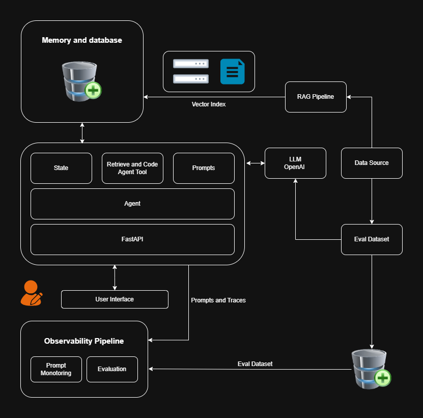

# 🛍️ Customer Support Chatbot for Retail

A production-ready AI chatbot designed to support retail businesses using **Retrieval-Augmented Generation (RAG)**, intelligent agents with **LangGraph**, and production-grade observability using **Opik**.

## 🧠 Architecture



## 📂 Dataset

The dataset contains customer queries and responses with categories for RAG routing. Each entry follows the format:

```json
{
  "doc": "Q: How can I view my past orders and their billing details?\nA1: You can view your past orders and their associated billing details by logging into your 'My Account' section on the Company ShopUNow website. Navigate to 'Order History' where each order will show its status, items, and billing summary.",
  "category": "Billing & Payment (External)"
}
```

## 🛠️ Technology Used

- **MongoDB** – State Management
- **Qdrant** – Vector Store for RAG
- **Opik** – LLM Observability & Evaluation
- **LangGraph & LangChain** – Agentic Frameworks
- **FastAPI** – Backend Web API
- **Streamlit** – Optional frontend for demo
- **Docker** – Containerization
- **uv** – Python dependency & venv manager

## 🔄 Workflow & Learning Outcomes

By building this project, you will master:

### 🔧 Agent Development
- LangGraph orchestration
- Short-term memory
- RAG pipelines for support scenarios

### 📦 RAG System Design
- Indexing with Qdrant
- Knowledge base construction
- Multi-turn contextual queries

### 🚀 Production Engineering
- FastAPI with WebSockets
- Dockerized infrastructure
- RESTful API best practices

### ⚙️ Workflow Steps
1. User enters a query via CLI or FastAPI endpoint.
2. LangGraph orchestrates the prompt through multiple nodes.
3. Vector search retrieves relevant documents from Qdrant.
4. Memory management fetches prior conversation states from MongoDB.
5. Agent responds using Groq-powered LLM.
6. Opik traces and logs observability for evaluation.

### 📊 LLMOps
- Observability using Opik
- Automated evaluation pipelines
- Prompt versioning and testing


## ✅ Evaluation Results

| Metric                    | Value        |
|---------------------------|--------------|
| Total Time                | 00:07:22     |
| Number of Samples         | 20           |
| Hallucination Metric      | 0.1175 (avg) |
| Answer Relevance Metric   | 0.8725 (avg) |
| Moderation Metric         | 0.0150 (avg) |
| Context Recall Metric     | 0.7800 (avg) |
| Context Precision Metric  | 0.7200 (avg) |

### 📈 Comet Dashboard


## 💡 Cloud Services Used

| Service       | Use Case           | API Key              |
|---------------|--------------------|-----------------------|
| **Groq**      | LLM Agent Runtime  | `GROQ_API_KEY`        |
| **Opik**      | LLMOps & Eval      | `COMET_API_KEY`       |
| **OpenAI**    | Evaluation & Test  | `OPENAI_API_KEY`      |
| **MongoDB**   | State Checkpoints  | `MONGODB_URI`         |
| **Qdrant**    | RAG Vector Store   | `QDRANT_API_KEY`      |

## 📚 Learn More

- [LangGraph Docs](https://docs.langgraph.org/)
- [Opik](https://www.comet.com/opik/)
- [Qdrant](https://qdrant.tech/)
- [GroqCloud](https://console.groq.com/)
- [MongoDB Atlas](https://www.mongodb.com/atlas)

## 📌 Pro Tips

- Use `uv pip install -r requirements.txt --link-mode=copy` on Windows to avoid hardlink errors.
- Use `make run` if Makefile is set up for agent execution.
- Use FastAPI Swagger UI at `http://localhost:8000/docs` when running via Docker.

## 🧾 License

The GNU General Public License is a free, copyleft license for
software and other kinds of works.
